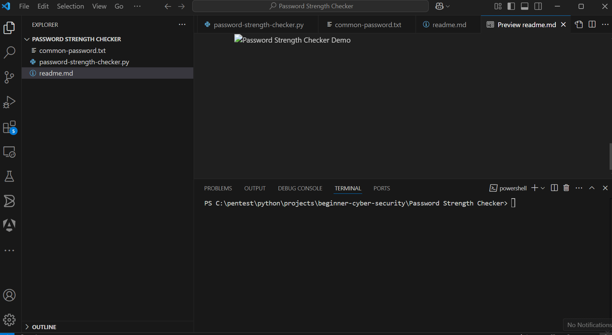

# 100 beginner-level Python projects for Cybersecurity

# Building a Password Strength Checker in Python

Hello again, and welcome to today's tutorial. Today, we are going to build a simple password strength checker using Python. We’ll explain how the code works step-by-step and give tips on how to improve your passwords.

## Why is Password Strength Important?

A weak password makes it easier for hackers to guess or crack using various methods, putting your personal information at risk. A strong password is:

## Password Requirements

To ensure security, passwords must meet the following criteria:

- **Minimum Length**: At least 12 characters long
- **Complexity**: Must include:
  - Uppercase letters (A–Z)
  - Lowercase letters (a–z)
  - Numbers (0–9)
  - Special characters (e.g., ! @ # $ % ^ & \*)
- **Unpredictability**:
  - Avoid using common or predictable words (e.g., "password", "123456", "admin", or personal info like names or birthdays)
  - Avoid repeating characters or using obvious keyboard patterns (e.g., "qwerty", "abc123")

**Example of a strong password**:  
`G7@hLp#9zVx2`

> 💡 Tip: Use a password manager to generate and store strong, unique passwords.

## Usage

You can check the strength of a password using the script:

```bash
python password-strength-checker.py
```

Enter a password to check: MyS3cur3@Passw0rd
Strength: ✅ Strong password

## Demo


